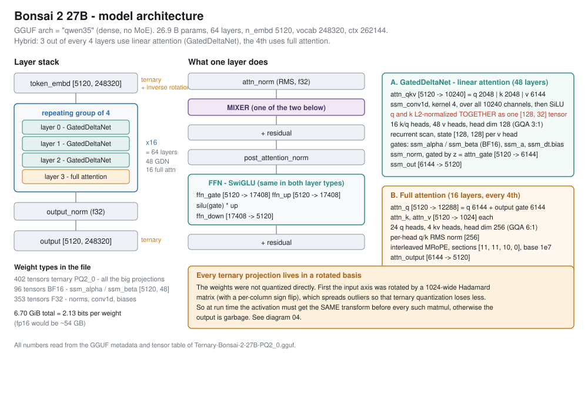
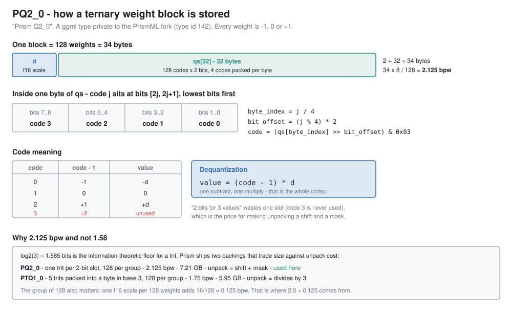
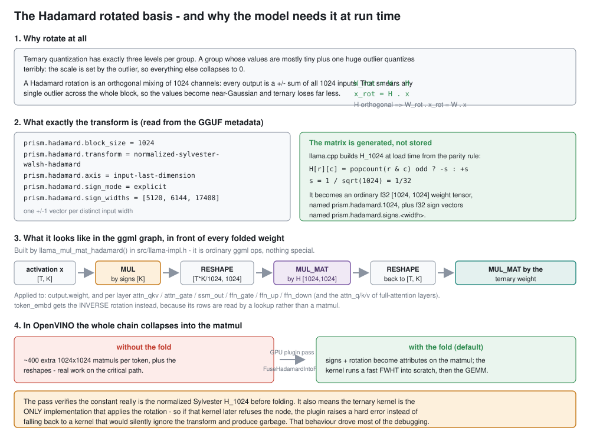
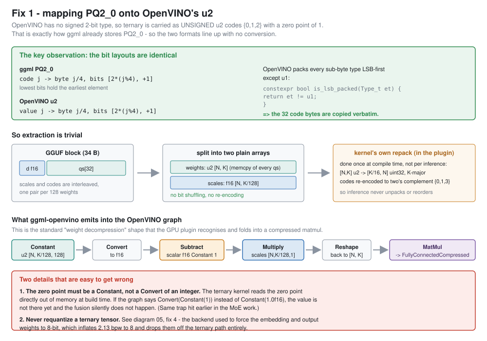
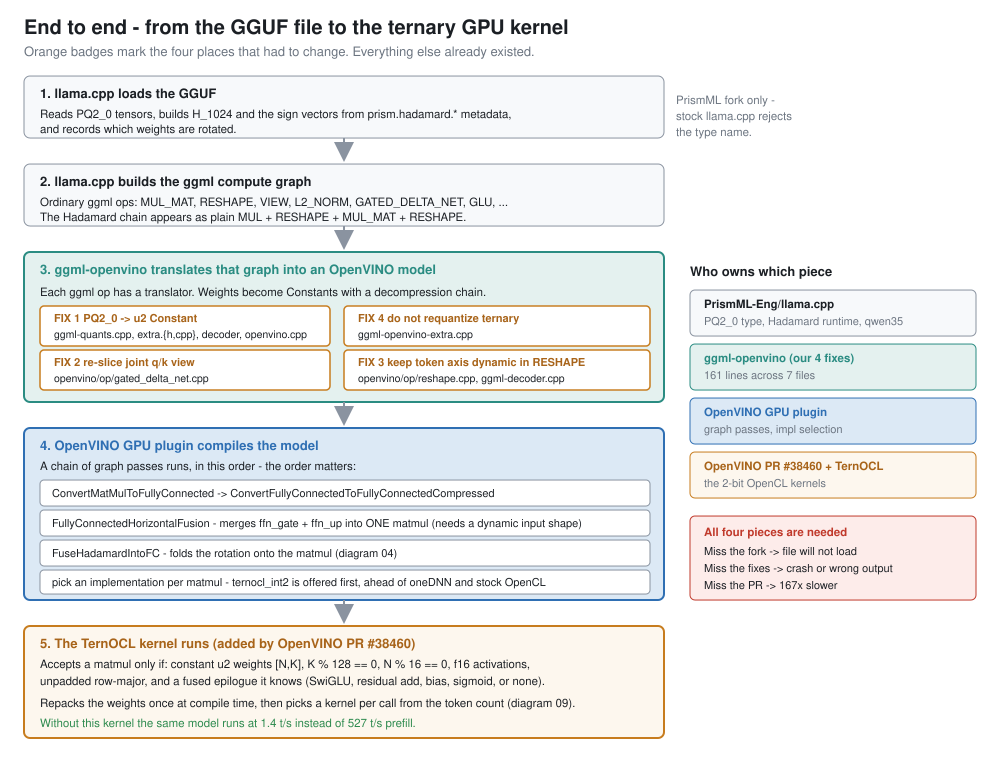
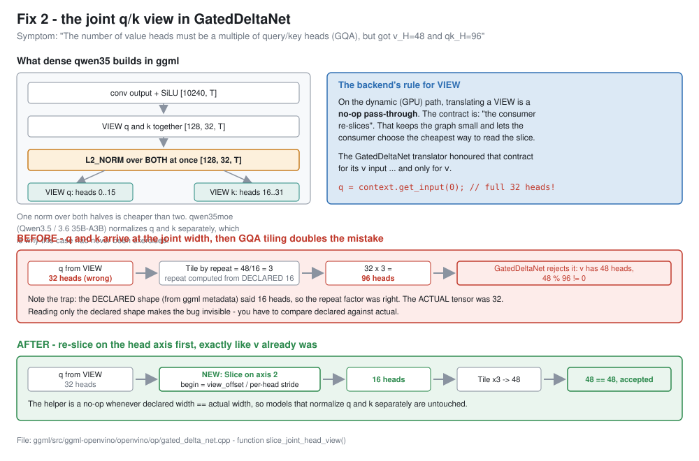
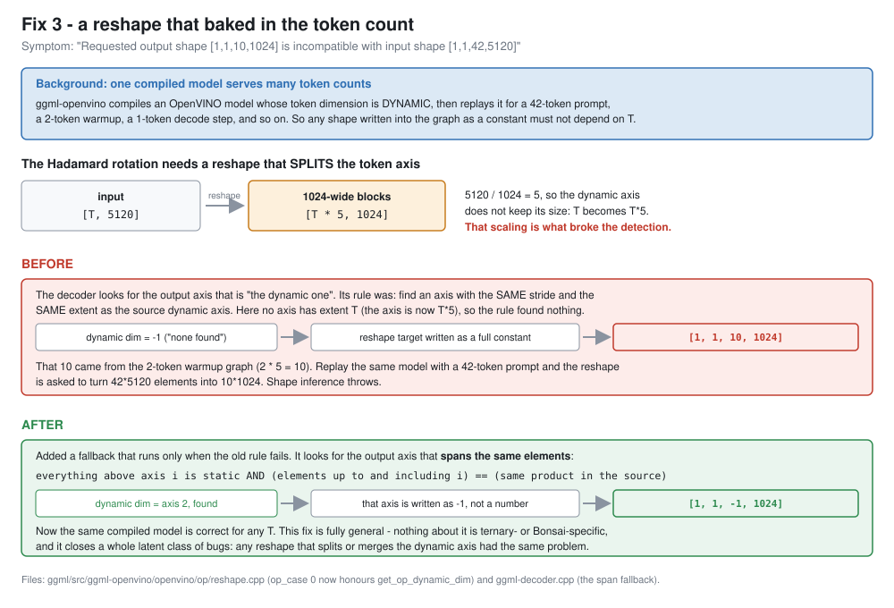
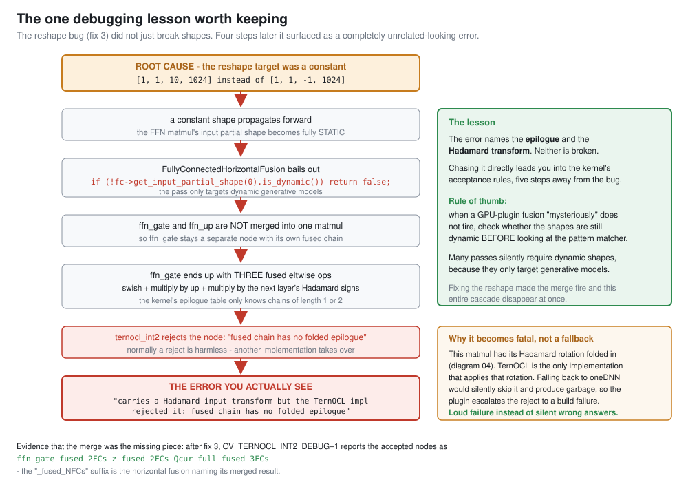
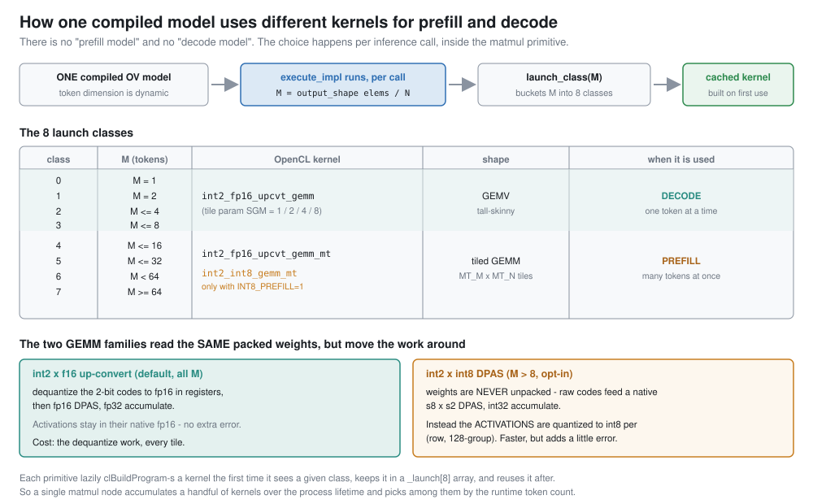
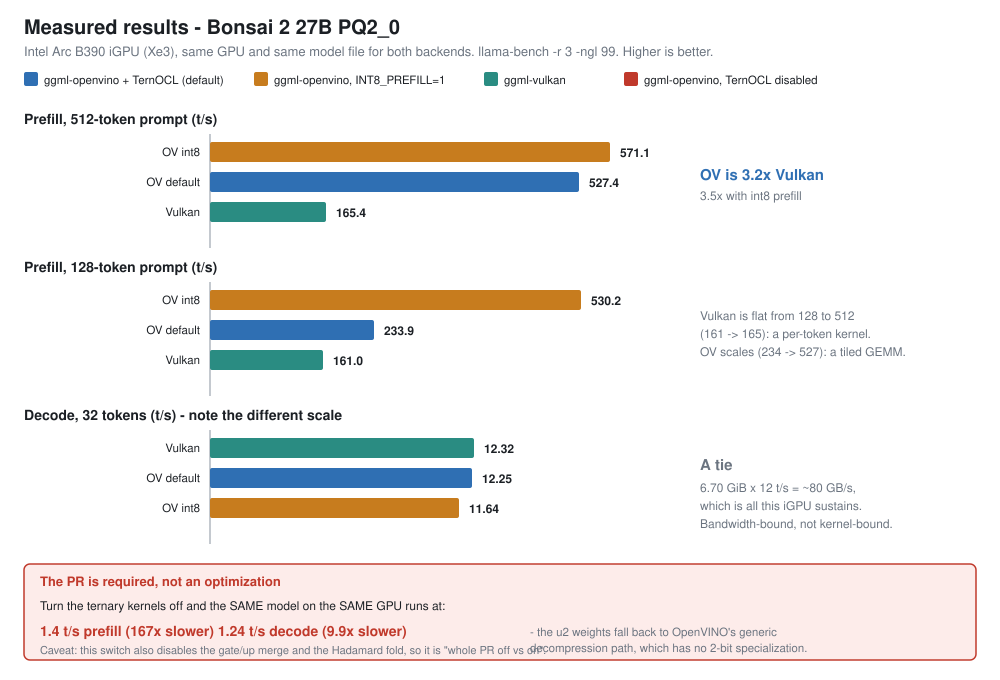

# Running a ternary 27B model on an Intel GPU - how it all fits together

A walkthrough of what Bonsai 2 27B is, how its 2-bit weights are stored, why it needs a
Hadamard rotation at run time, and what had to change in llama.cpp's OpenVINO backend to make
it run on an Intel GPU.

Written to be readable without prior knowledge of this codebase. Measured numbers and the terse
engineering version are in `BONSAI2_TERNARY_OV_REPORT.md`; this file explains the *why*.

---

## TL;DR

| | |
|---|---|
| **Model** | Bonsai 2 27B, a ternary (-1 / 0 / +1) quantization of a 27 B hybrid-attention LLM. 6.70 GiB at 2.13 bits per weight, vs ~54 GB at fp16. |
| **Goal** | Run it through llama.cpp's OpenVINO backend on an Intel GPU, using the new 2-bit OpenCL kernels from OpenVINO PR #38460, and compare against llama.cpp's Vulkan backend. |
| **Work needed** | 161 lines across 7 files in `ggml/src/ggml-openvino`. Four independent fixes. |
| **Outcome** | Correct output, and **3.2x faster prefill than Vulkan** (527 vs 165 t/s). Decode is a tie because both backends are limited by memory bandwidth, not by math. |
| **Biggest surprise** | Without the PR's 2-bit kernels, the same model runs **167x slower**. The kernels are not an optimization, they are the difference between usable and unusable. |

---

## 1. What the model is



Bonsai 2 27B declares itself as architecture `qwen35` in its GGUF file - a 27 B dense model
(no mixture-of-experts), 64 layers, hidden size 5120, 248320-token vocabulary, 262 k context.

The interesting part is that it is a **hybrid attention** model. Only every 4th layer uses the
attention you would expect. The other three quarters use a *linear attention* mechanism called
**GatedDeltaNet**:

- **48 layers - GatedDeltaNet.** Instead of comparing every token against every other token,
  this keeps a fixed-size recurrent state (a 128 x 128 matrix per head) and updates it as tokens
  stream past. Cost per token is constant, so long contexts stay cheap. This is why the model can
  claim a 262 k context without a 262 k-sized attention matrix.
- **16 layers - full attention.** Normal softmax attention with 24 query heads over 4 key/value
  heads, so the model still has a way to do precise long-range lookups.

Every layer, of both kinds, then runs the same SwiGLU feed-forward network
(5120 -> 17408 -> 5120).

### Why that matters here

The GatedDeltaNet layers are where two of the four fixes landed. Linear attention has a more
intricate graph than plain attention - a 1-D convolution over q/k/v, per-head normalization,
two learned gates, and a recurrent scan - and that gave more surface area for shape bugs.

---

## 2. How PQ2_0 stores a ternary weight



Every weight in the big projections is one of three values: `-1`, `0`, `+1`. Storing a *trit*
needs `log2(3) = 1.585` bits in theory. PQ2_0 ("Prism Q2_0", a ggml type private to the PrismML
fork) spends a bit more for simplicity:

- Weights are grouped in **blocks of 128**.
- Each block has **one fp16 scale** `d` (2 bytes) and **32 bytes of codes** (128 codes x 2 bits).
- A code is `0`, `1` or `2`, and the value is **`(code - 1) * d`**. Code `3` is never used.

That is 34 bytes per 128 weights = **2.125 bits per weight**. The 2 bits of payload plus
`16 / 128 = 0.125` bits of scale is exactly where the number comes from.

The wasted 4th code buys something real: unpacking is a shift and a mask, nothing more. The
sibling format `PTQ1_0` packs 5 trits into a byte in base 3 and reaches 1.75 bpw, but then
unpacking needs divisions. Prism ships both and lets you choose.

> **A useful way to think about it:** the model is not "compressed and then decompressed". The
> weights genuinely *are* -1/0/+1. The scale just restores the magnitude per group of 128.

---

## 3. The twist: the weights live in a rotated basis



This is the part that makes the model unusual to support, and it is worth understanding before
looking at any code.

**The problem.** Ternary quantization has three levels per group. If a group of 128 numbers is
mostly small but contains one large outlier, the scale gets set by the outlier and everything
else rounds to 0. You lose almost all the information.

**The trick.** Before quantizing, multiply the weight's input axis by a **Hadamard matrix** - an
orthogonal matrix of `+s` and `-s` entries. Every output channel becomes a plus/minus sum of all
1024 input channels, so any single outlier is smeared across the whole block and the values turn
roughly Gaussian. Ternary then loses far less.

Because the matrix is orthogonal, the math is unchanged *provided you rotate the activation the
same way*:

```
W_rot = W . H        (done once, offline, by whoever quantized the model)
x_rot = H . x        (must happen at run time, every forward pass)

W_rot . x_rot  ==  W . x
```

**The consequence.** If you load these weights and skip the activation rotation, you do not get a
slightly worse answer - you get garbage. The model card warns about exactly this. So the rotation
is not an optimization detail, it is part of the model definition.

For this model the transform is a 1024-wide normalized Sylvester-Walsh-Hadamard matrix (scaled by
`1/sqrt(1024) = 1/32`), preceded by a fixed per-channel sign flip. llama.cpp does not load the
matrix from the file - it *generates* it at load time from a parity rule, and reads the sign
vectors out of the GGUF metadata.

In the ggml graph this shows up as four ordinary ops in front of every ternary matmul:

```
x -> MUL by signs -> RESHAPE to [T*K/1024, 1024] -> MUL_MAT by H -> RESHAPE back -> MUL_MAT by W
```

Nothing exotic. Which is good news: a backend that supports `MUL`, `RESHAPE` and `MUL_MAT`
already supports the rotation - just slowly, since it is ~400 extra 1024x1024 matmuls per token.
The OpenVINO GPU plugin has a pass that recognises that chain and folds it into the matmul, so a
fast fused kernel does it instead.

---

## 4. Teaching the OpenVINO backend to read PQ2_0



OpenVINO has no *signed* 2-bit type. It has unsigned `u2`. So ternary is represented as codes
`{0, 1, 2}` with a **zero point of 1**, dequantized as `(code - 1) * scale`.

If that sounds familiar, it is because it is byte-for-byte what PQ2_0 already does. And the bit
packing matches too: both put element `j` at bits `[2*(j%4), +1]` of byte `j/4`, lowest bits
first. (OpenVINO packs every sub-byte type LSB-first except `u1`.)

**So the conversion is a `memcpy`.** The 32 code bytes of each block are copied straight into an
OpenVINO `u2` constant, with no bit shuffling and no re-encoding. Only the fp16 scales need
gathering into a separate array, because ggml interleaves scale and codes while OpenVINO wants
them separate.

The backend then emits the standard "weight decompression" shape that the GPU plugin knows how to
fold into a compressed matmul:

```
Constant(u2) -> Convert(f16) -> Subtract(1) -> Multiply(scales) -> Reshape -> MatMul
```

Two things here are easy to get wrong, and both were real bugs:

1. **The zero point must be a `Constant`, not a `Convert` of an integer constant.** The ternary
   kernel reads that value directly out of memory when it builds. A `Convert` node has not
   produced a value yet, so the fusion silently does not happen.
2. **Never requantize a ternary tensor.** The backend had a rule that forced the token embedding
   and output projection to 8-bit, for good reasons on other models. On this model it inflated
   2.13 bpw to 8 bpw *and* knocked the output projection off the ternary path. That is fix 4.

---

## 5. The four fixes



The diagram above shows the whole path from GGUF file to GPU kernel, with the four changes
marked. Two of them are about the ternary format; two are about shapes.

### Fix 1 - read PQ2_0 as `u2`

Covered in section 4. Mechanical once you notice the bit layouts already agree.

### Fix 2 - the joint q/k view in GatedDeltaNet



This model normalizes its query and key tensors **together**, as one 32-head tensor, then takes
two 16-head views of the result. That is cheaper than two separate normalizations.

The OpenVINO backend has a design rule: translating a `VIEW` is a **no-op pass-through**, and the
*consumer* is responsible for slicing out the part it wants. The GatedDeltaNet translator honoured
that rule for its `v` input - and only for `v`. So `q` and `k` each arrived carrying all 32 heads.

Then it got worse. Linear attention here is grouped-query: 16 q/k heads serve 48 value heads, so
q and k get tiled 3x. The tiling factor was computed from the *declared* shape (16, correct) but
applied to the *actual* tensor (32, wrong), producing 96 heads against 48 value heads. The op
rejected it.

The fix re-slices `q` and `k` on the head axis, exactly as `v` already was. It is a no-op when the
declared width already matches the actual width, so models that normalize q and k separately -
including Qwen3.5 and Qwen3.6 35B-A3B, which is why nobody had hit this - are untouched.

**Worth internalising:** the declared shape said 16 and the real tensor was 32. If you only look
at the metadata, this bug is invisible. You have to compare declared against actual.

### Fix 3 - a reshape that baked in the token count



The OpenVINO backend compiles a model whose **token dimension is dynamic**, then replays that one
compiled model for a 42-token prompt, a 2-token warmup, a 1-token decode step, and so on. So no
shape written into the graph as a constant may depend on the token count `T`.

The backend works out which output axis of a reshape is "the dynamic one" so it can write `-1`
there instead of a number. Its rule was: find the axis with the same stride *and the same extent*
as the source's dynamic axis.

The Hadamard rotation breaks that rule, because its reshape **splits** the token axis:
`[T, 5120]` becomes `[T*5, 1024]`. No output axis has extent `T` any more - it has extent `T*5`.
So the rule found nothing, the whole target shape was written as a constant, and the number baked
in came from whichever graph was captured first (a 2-token warmup, giving `[1,1,10,1024]`).
Replaying with 42 tokens then threw a shape error.

The fix adds a fallback that runs only when the old rule fails: find the output axis that *spans
the same elements* - everything above it static, and the same element count up to and including
it. This is fully general; nothing about it is ternary- or Bonsai-specific, and it closes a latent
class of bugs affecting any reshape that splits or merges the dynamic axis.

### Fix 4 - keep ternary weights out of requantization

The backend requantized `token_embd.weight` and `output.weight` to 8-bit unconditionally. Every
requantization target is 4-bit or wider, so on a ternary model this can only make things worse.
Return "no requantization" for PQ2_0 and move on.

---

## 6. The debugging lesson



This is the most transferable thing in the whole project, so it gets its own diagram.

Fix 3 (the baked reshape) did not announce itself as a shape bug. It surfaced, four steps later,
as this:

```
[GPU] ternocl int2: ...ffn_gate... carries a Hadamard input transform
      but the TernOCL impl rejected it: fused chain has no folded epilogue
```

Nothing in that message is wrong, and nothing it names is broken. The causal chain was:

1. The reshape target was a constant, so the shape downstream became **static**.
2. `FullyConnectedHorizontalFusion` - the pass that merges `ffn_gate` and `ffn_up` into one
   matmul - starts with `if (!input_shape.is_dynamic()) return false;`. It silently bailed.
3. So `ffn_gate` stayed a separate node and accumulated **three** fused element-wise ops
   (the SiLU, the multiply by `up`, and the next layer's Hadamard sign multiply).
4. The ternary kernel's epilogue table only knows chains of length 1 or 2. It rejected the node.
5. Normally a rejection is harmless - another implementation takes over. But this matmul had its
   Hadamard rotation folded in, and the ternary kernel is the *only* implementation that applies
   that rotation. Falling back would silently produce garbage, so the plugin **escalates the
   rejection to a hard build failure** on purpose.

Chasing the error message leads into the kernel's acceptance rules, five steps from the cause.
Fixing the reshape made the merge fire and the entire cascade vanish at once.

> **Rule of thumb:** when a GPU-plugin fusion mysteriously does not fire, check whether the shapes
> are still dynamic *before* studying the pattern matcher. Several passes silently require dynamic
> shapes, because they only target generative models.

The confirmation that the merge was the missing piece: after fix 3, the kernel's debug output
names the accepted nodes `ffn_gate_fused_2FCs`, `z_fused_2FCs`, `Qcur_full_fused_3FCs` - the
`_fused_NFCs` suffix is the horizontal fusion naming its merged result.

---

## 7. How one compiled model uses two different kernels



A natural question: if prefill and decode run on the same compiled model, how can they use
different kernels?

They can because **the kernel is not chosen at compile time**. Inside the matmul primitive, on
every inference call:

```cpp
const size_t M = ov::shape_size(params->output_layouts[0].get_shape()) / _N;  // tokens, at run time
if (M > 8 && int8_prefill_enabled())
    return execute_int8(...);
auto& l = get_launch(M);
```

`launch_class(M)` buckets the token count into 8 classes. `get_launch` returns the cached kernel
for that class, or builds it with `clBuildProgram` on first use and keeps it in an 8-slot array.
So a single matmul node accumulates a handful of OpenCL kernels over the process lifetime and
picks among them per call:

- **M <= 8** (decode): a GEMV, tuned for one or a few tokens.
- **M > 8** (prefill): a tiled GEMM.

Both read the *same* packed weights, but move the work around differently:

| | weights | activations |
|---|---|---|
| **int2 x f16 up-convert** (default) | dequantized to fp16 in registers, then fp16 matrix instructions | stay in native fp16 - no extra error |
| **int2 x int8** (`OV_TERNOCL_INT2_INT8_PREFILL=1`, prefill only) | never unpacked - raw 2-bit codes feed a native int8 x int2 matrix instruction | quantized to int8 per (row, 128-group) - faster, slightly lossy |

---

## 8. Results



Intel Arc B390 iGPU, same GPU and same model file for both backends.

| | pp128 | pp512 | tg32 | tg128 |
|---|---:|---:|---:|---:|
| ggml-openvino + ternary kernels | 233.9 | 527.4 | 12.25 | 11.28 |
| ggml-openvino, `INT8_PREFILL=1` | **530.2** | **571.1** | 11.64 | - |
| ggml-vulkan | 161.0 | 165.4 | **12.32** | **12.31** |
| ggml-openvino, ternary kernels off | 1.4 | - | 1.24 | - |

**Prefill: OpenVINO wins by 3.2x** at a 512-token prompt. The shape of the curve is as
informative as the ratio - Vulkan is flat from 128 to 512 tokens (161 -> 165 t/s), which is what a
per-token kernel does, while OpenVINO scales (234 -> 527), which is what a tiled GEMM does.

**Decode is a tie, and that is expected.** Generating one token requires reading essentially the
whole model: 6.70 GiB x 12 t/s is about 80 GB/s, roughly all this integrated GPU can sustain.
Both backends are sitting on the memory-bandwidth wall, so neither kernel can pull ahead. Decode
on this hardware simply cannot distinguish the two; that needs a discrete GPU.

**The PR's kernels are mandatory.** Turn them off and the same model drops to 1.4 t/s prefill.
(Caveat: that switch also disables the gate/up merge and the Hadamard fold, so it measures "whole
PR off vs on", not the kernel alone.)

### Correctness

- OpenVINO GPU output is **identical to the CPU reference** on a short greedy prompt.
- Default and `INT8_PREFILL=1` were **byte-identical** over 90 greedy tokens here.
- Vulkan agrees in substance but diverges in wording after ~35 greedy tokens - ordinary near-tie
  drift between different kernels, not a correctness failure.
- The op-level test suite: **8079 / 8084**, and all 5 failures reproduce on an unmodified build,
  so they pre-date this work.

---

## 9. What you need to run it

All four pieces are required, and each fails differently if missing:

| piece | if missing |
|---|---|
| `PrismML-Eng/llama.cpp` (branch `prism`) | the file will not load - stock llama.cpp rejects the type |
| the four ggml-openvino fixes | crash at graph build, or wrong output |
| OpenVINO built with PR #38460 | runs, but 167x slower |
| an Intel GPU with the OpenCL runtime | the ternary kernels require it |

```sh
source <openvino-install>/setupvars.sh
GGML_OPENVINO_DEVICE=GPU ./build-pr/bin/llama-cli \
  -m Ternary-Bonsai-2-27B-PQ2_0.gguf -p "The capital of France is" \
  -n 20 -c 512 --no-warmup -st --temp 0
```

Useful switches while poking at it:

| variable | effect |
|---|---|
| `OV_TERNOCL_INT2_DEBUG=1` | prints accept/reject plus the reason, per matmul |
| `OV_TERNOCL_INT2_CFG_DEBUG=1` | prints the chosen tile and kernel per shape |
| `OV_TERNOCL_HADAMARD_DEBUG=1` | traces the rotation fold |
| `OV_TERNOCL_INT2_INT8_PREFILL=1` | the faster, slightly lossy prefill kernel |
| `OV_TERNOCL_INT2_FUSE_HADAMARD=0` | leave the rotation in the graph instead of folding it |
| `OV_TERNOCL_INT2_DISABLE=1` | turn the whole PR off |
| `GGML_OPENVINO_DUMP_CGRAPH=1` | dump the ggml graph to `cgraph_ov.txt` |

**One benchmarking trap worth repeating:** the OpenVINO backend compiles a graph per token count,
and that compile takes tens of seconds on a 27 B model. `llama-bench --no-warmup` puts it *inside*
the measured run and reports 4 t/s instead of 234. Always let it warm up.
